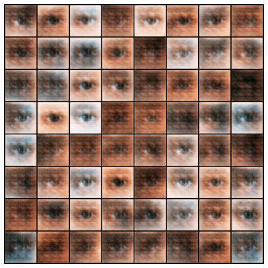
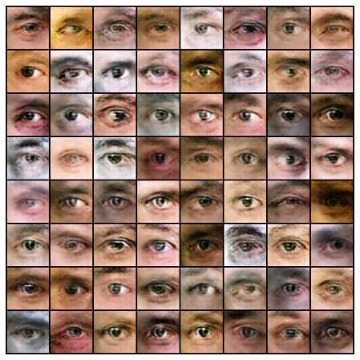
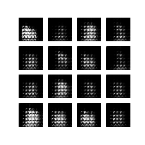

# GANs
- `pytorch_eyes.ipynb`: DCGAN on eye images dataset [pavelbiz/eyes-rtte](https://www.kaggle.com/datasets/pavelbiz/eyes-rtte) with PyTorch. Sorry for the overlong print of that one cell, please just start scrolling from the bottom.

| 5 epochs  | 25 epochs |
| ------------- | ------------- |
|   |   |

- `adversarial.m`: Goodfellow et al., "Explaning and harnessing adversarial examples" argued that the linear part of the high dimensional deep neural network could not resist adversarial examples, although the linear behavior speeded up the training. Here's the implementation of linear explanation of adversarial examples.
- `FGSM_tf.ipynb`: Attacking Resnet50 with Fast Gradient Sign Method (FGSM) and Fast Gradient Value methods proposed in [Explaining and Harnessing Adversarial Examples](https://arxiv.org/pdf/1412.6572.pdf) and [Adversarial Diversity and Hard Positive Generation](https://arxiv.org/pdf/1605.01775.pdf), respectively.
- `DCGAN_fashion`: Implementing [Deep Convolutional GANs](https://arxiv.org/pdf/1511.06434.pdf) with Tensorflow and generating images based on Fashion MNIST dataset. A visualization of the process is like below:

